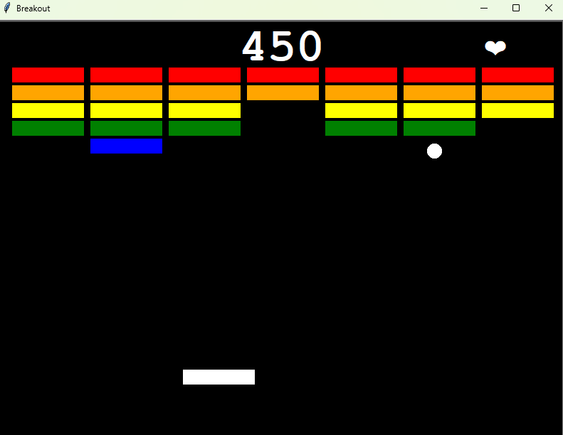
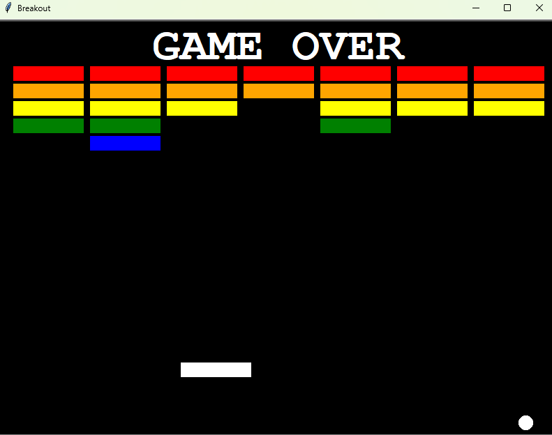

# Breakout Game

## About
A classic Breakout arcade game built with Python's Turtle graphics. Destroy colorful brick walls by bouncing a ball with your paddle while protecting against losing lives. Features dynamic ball physics, collision detection, and a scoring system.

## Screenshots



## How to Play
1. Press **UP arrow** to start the game
2. Use **LEFT** and **RIGHT arrow keys** to move the paddle
3. Bounce the ball to destroy the colored brick walls
4. Each brick destroyed scores 50 points
5. You have 3 lives - don't let the ball fall off the bottom!
6. Destroy all bricks to win

## Game Features
- 🎮 Progressive difficulty with 5 rows of color-coded bricks
- ❤️ 3-life system with visual indicator
- 🎯 Dynamic ball physics based on paddle hit location
- 🏆 Score tracking (50 points per brick)
- 🎨 Colorful brick layout (Red, Orange, Yellow, Green, Blue)

## Requirements
- Python 3.x
- Turtle graphics (built-in with Python)

## Installation
1. Clone the repository
```bash
git clone https://github.com/yourusername/breakout-game.git
cd breakout-game
```

2. Run the game
```bash
python main.py
```

## Controls
| Key | Action |
|-----|--------|
| UP Arrow | Start/Resume Game |
| LEFT Arrow | Move Paddle Left |
| RIGHT Arrow | Move Paddle Right |

## Project Structure
```
.
├── main.py          # Main game loop and initialization
├── paddle.py        # Paddle class
├── ball.py          # Ball class with physics
├── wall.py          # Wall/Brick class
├── scoreboard.py    # Scoreboard and UI
└── README.md        # This file
```

## License
This project is open source and available under the MIT License.

## Author
Created as part of the 100 Days of Python challenge.
